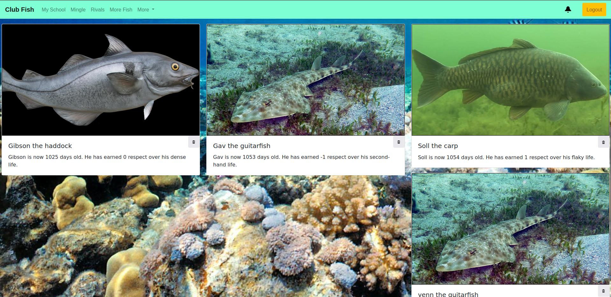

# Club Fish

### A "social networking" website where you can create and name different types of fish, and interact with other users' fish.

A Flask web app written for the final project of Harvard's CS50 online course.

The login page looks like this:

Users can create a new account or log in to a previous one. Usernames and passwords are stored using hashes in a sqlite database.

Once logged in, the home page displays the user's previously created fish:

A short bio is auto-generated from the fish's name and number of times it has been 'respected'.

The 'rivals' tab displays other users' fish, including a Hall of Fame which shows the most and least respected fish in the database. Users can comment on and respect other users' fish.

New fish can be created and named manually, or by combining any two existing fish in the 'Mingle' tab.

The bell in the top right corner turns red and when clicked displays a list of any recent interactions other users have had with your fish.